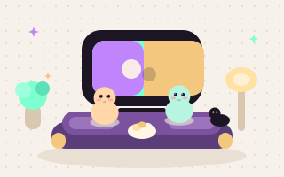
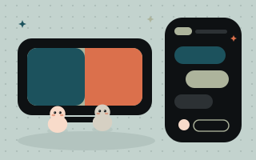

# Chillax

<p align="center">
  
</p>

<p align="center"><strong>Make the couch bigger.</strong></p>

Free Chrome watch party for **YouTube** and **Netflix**: synced playback, group chat, voice/video, avatars, and emoji that float up the screen.

Everyone uses their own YouTube or Netflix account. Chillax does not skip, hide, or block platform ads, and it does not re-stream or decrypt video.

The overlay is a cream dotted storyboard on night purple — blob buddies, mint / lilac / butter sparkles — not a generic dark sidebar.

## Install (unpacked, for you)

1. Install [Node.js 20+](https://nodejs.org/).
2. In this folder:
   ```bash
   npm install
   npm run build
   ```
3. Open `chrome://extensions`, turn on **Developer mode**, click **Load unpacked**, and select the `dist` folder.
4. Pin Chillax. Open a YouTube video or a Netflix title (`/watch/...`), then start a party.

Development with reload:

```bash
npm run dev
```

Load unpacked from `dist` (CRXJS writes the extension there).

## Send to friends (no Chrome Web Store)

Friends cannot double-click a `.crx`. They load the unzipped folder once.

Live installer: [chillax-ruby.vercel.app](https://chillax-ruby.vercel.app). Send friends that link. Every push to `main` rebuilds that site. The download is named with the current version, for example `chillax-1.0.0.zip`.

Versioned zips also live on [GitHub Releases](https://github.com/ganeshdipdumbare/chillax/releases). Each `v*` tag keeps its own zip forever (`v1.0.1` → `chillax-1.0.1.zip`).

`package.json` is the only version. The Chrome manifest, zip filename, and installer button all read it.

```bash
npm run release          # 1.0.0 → 1.0.1, tag v1.0.1, push
npm run release -- minor # 1.0.1 → 1.1.0
npm run release -- major # 1.1.0 → 2.0.0
```

That updates the live installer and attaches `chillax-<version>.zip` to a GitHub Release. You can also run **Cut release** from the Actions tab.

To publish the current version without bumping:

```bash
npm run pack-site
npx vercel deploy --prod
```

The site is `install.html` plus the storyboard art and `chillax-<version>.zip`. They download, unzip, and follow the steps. Chrome still will not install from a webpage the way the Web Store does.

Without Vercel, pack locally:

1. `npm run pack` writes `chillax-<version>.zip` in this folder (for example `chillax-1.0.0.zip`).
2. Send that zip (AirDrop, iMessage, Drive).
3. Tell them: unzip it, open `install.html`, follow the six steps.

The guide is [public/install.html](public/install.html). It also ships inside the zip.

They must leave the unzipped folder on disk. After Chrome restarts, if a “Disable developer mode extensions” popup appears, they click **Cancel**.

## Storybook

UI pieces (avatars, chat, reactions, lounge art) run in isolation:

```bash
npm run storybook
```

Open [http://localhost:6006](http://localhost:6006). Static export: `npm run build-storybook`. Look at **Lounge / FullSidebar** for the floating setup card and the right-side chat dock.

## How to party

<p align="center">
  
</p>

1. Host opens the same video everyone will watch.
2. Pick an avatar in the **left** lounge card, then **Start the night** (or join with a code).
3. Chat **docks on the right**. The movie stays on the left. **Hide chat** tucks the panel without leaving; **Leave party** is the pink control.
4. Copy the invite link (YouTube query `?chillax=`, Netflix hash `#chillax=`).
5. Guests install Chillax and open the invite link — they join automatically. Mic and camera stay **off** until someone turns them on.
6. Mute and camera are one click. Use the reaction bar under chat. Parties cap at **8** people.
7. Hosts keep playback by default. **Tap a person** in the party to let them play, pause, and seek.

If Netflix strips the hash, guests can paste the party code (starts with `cx`) under **Join with code**. Chillax opens the host’s title for them.

A YouTube host cannot sync a Netflix guest.

<p align="center">
  
</p>

## Voice and video

Mic and camera run in an extension page, so Chrome should prompt for **Chillax**, not YouTube or Netflix.

Audio and video are **WebRTC mesh** between browsers. Chat and playback sync use a host-centered DataChannel. Signaling uses the public [PeerJS](https://peerjs.com/) broker; media is not sent through that broker after connect.

v1 uses STUN only (no TURN). Some networks (symmetric NAT / strict firewalls) will fail the call. Chat and playback sync may still work. A TURN server (for example [Metered](https://www.metered.ca/tools/openrelay/)) is the first reliability upgrade.

Use headphones so the mic does not pick up the movie or other people.

## Privacy

- Chillax does not store chat, video, or audio on a server we run.
- Nickname and avatar are saved in `chrome.storage.local` on your machine.

## Publish to the Chrome Web Store

Google reviews every listing. Watch-party extensions that overlay YouTube/Netflix can be approved (Teleparty is in the store), but it is not guaranteed. Follow these steps.

### 1. Make a developer account

1. Sign in with a Google account at [Chrome Web Store Developer Dashboard](https://chrome.google.com/webstore/devconsole).
2. Pay the one-time **$5** registration fee.
3. Complete identity / tax info if Google asks. A published extension that uses camera/mic is easier to trust with a real publisher name.

### 2. Put a privacy policy on the public web

Chrome will reject camera + microphone without a policy URL. Host a page (GitHub Pages, Notion public page, or your site) that says, in plain language:

- What you collect: nickname and avatar in local storage only.
- What you do **not** collect: chat, voice, video, and watch history are peer-to-peer and not stored by you.
- Permissions: `storage`, `camera`, `microphone`, and access to YouTube/Netflix pages to sync the player and show the overlay.
- How to delete data: uninstall the extension.
- Contact email.

### 3. Build a store zip

```bash
npm run build
cd dist
zip -r ../chillax-extension.zip .
```

Zip the **contents of `dist`**, not the parent repo. Do not include `node_modules` or source.

Bump `version` in [package.json](package.json) before each upload (for example `npm run release`). The Chrome manifest reads that number. Chrome does not accept a reused version number.

### 4. Screenshots and listing copy

In the dashboard, **New item** → upload `chillax-extension.zip`.

You will need:

- **Icon:** 128×128 Cx mark (already at `public/icons/icon128.png`).
- **Screenshots:** at least one 1280×800 or 640×400 of the overlay on YouTube (and Netflix if you can). Crop so Chillax is obviously a separate overlay, not YouTube/Netflix UI. The cream storyboard and Cx conic mark are the look — not a generic dark drawer.
- **Small promo tile** (optional): 440×280. [public/art/lounge.svg](public/art/lounge.svg) is the same drawing as the overlay.
- **Name:** Chillax
- **Summary:** Watch YouTube and Netflix together with synced playback, chat, and voice/video.
- **Category:** Social or Fun (pick the closest).
- **Language**
- **Single purpose:** say it syncs playback and adds party chat/call on those sites. Do not claim to be YouTube or Netflix.

Permission justifications (write honestly):

- `storage` — save nickname and avatar on this device.
- `camera` / `microphone` — optional in-party call; prompted as Chillax.
- Host access to youtube.com / netflix.com — inject the party overlay and control the local player. Users still need their own account. You do not download or decrypt video.

### 5. Privacy practices form

In the listing, declare:

- You do **not** sell user data.
- You do **not** use remote code except the PeerJS signaling host (disclose `0.peerjs.com` as the WebRTC broker).
- Limited use of YouTube/Netflix page access: overlay + player sync only.

### 6. Submit for review

Click **Submit for review**. First review often takes a few days. Common rejection reasons:

- Overlay looks like official YouTube/Netflix chrome.
- Missing or vague privacy policy.
- Camera/mic used without a clear in-product prompt.
- Unrelated host permissions.
- Version / zip mismatch.

If rejected, Google emails a reason. Fix, bump the version, upload a new zip.

### 7. After it is live

- Share the store URL. Guests still install Chillax, then open your invite link.
- Each store update: bump version → `npm run build` → zip `dist` → upload → submit again.
- Keep the privacy policy URL working forever, or the listing can be taken down.

## Verify locally

Use two Chrome profiles with the unpacked extension.

- YouTube: same video; play/pause/seek follow the host; tap a person to grant them control; chat and reactions appear in the right dock; SPA navigation still finds the player.
- Voice/video: mic and camera start off; tiles only in the Chillax panel; movie audio still plays.
- Netflix: logged-in profiles that can play the same title; hash invite or join-with-code; wrong-title prompt if IDs differ.

Netflix cannot be verified without a logged-in Netflix session.
